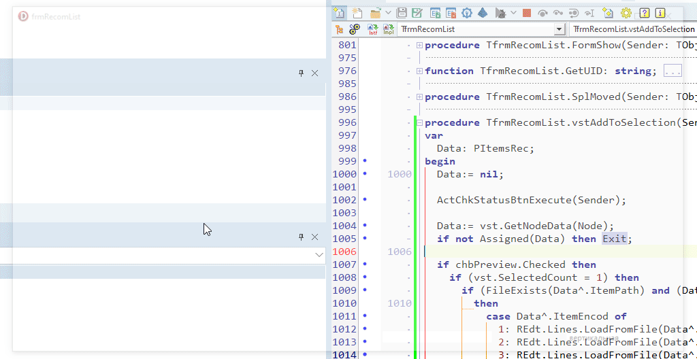
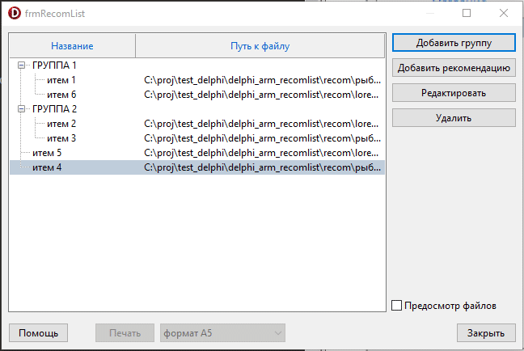
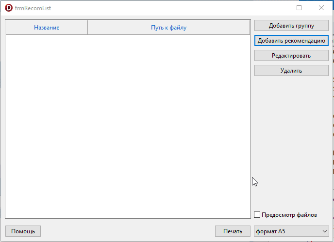
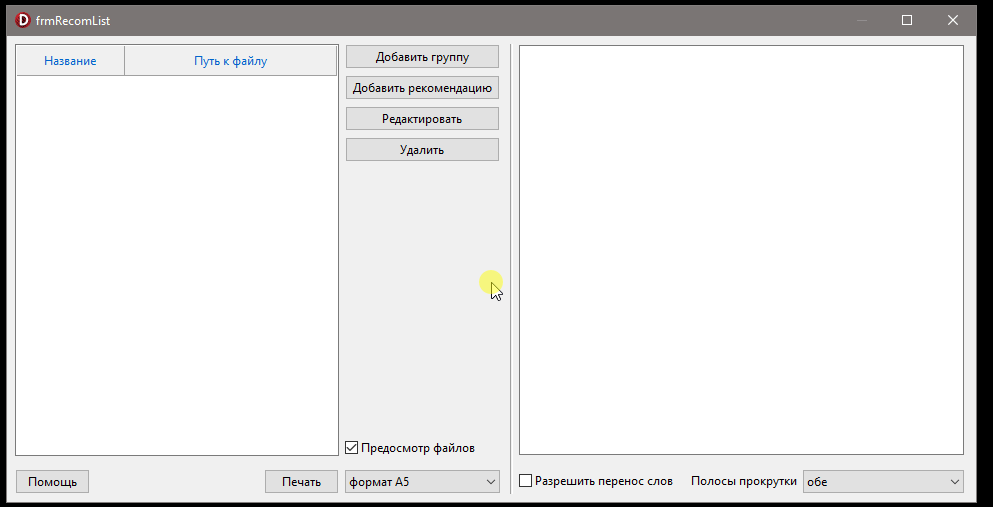
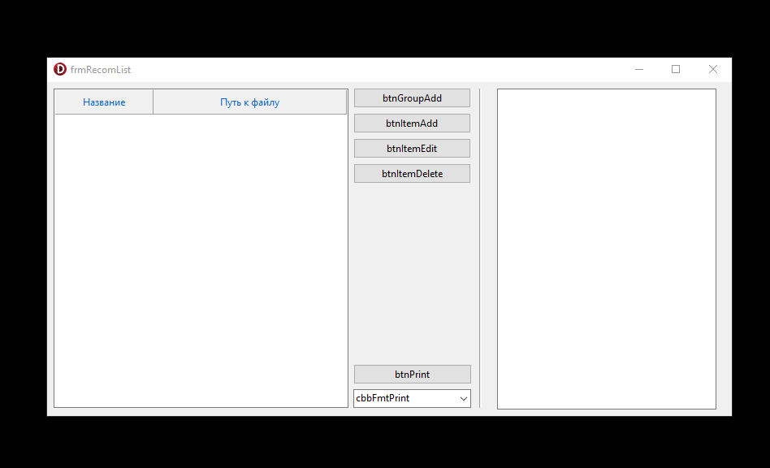

# delphi_arm_recomlist

0.0.8
- реализован просмотр содержимого файла по ссылке

0.0.7
- реализовано чтение и парсинг списка дерева из ini-файла

 

0.0.6
- реализованы процедуры добавления/удаления узлов
- реализована запись списка дерева в ini-файл

0.0.5
- temp commit

0.0.4
- added frmNodeInfo
- basic design of frmNodeInfo

0.0.3
- saving form settings is implemented

0.0.2
- redesign of form
- implemented show/hide preview window

0.0.1
- initial commit

